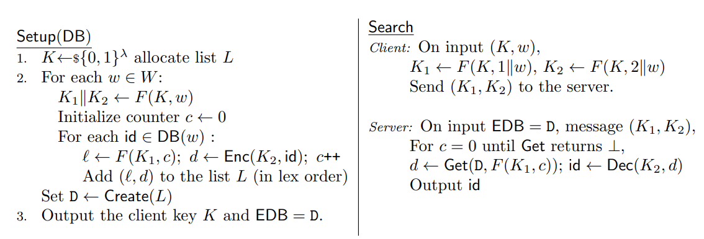

## Encrypted DB

This repository is the solution to the following challenge:
*Implement an SSE scheme in a database and then explain the security features (a write up) - 
explaining why this SSE works and why it's secure.*

A solution is based on an algorithm from [CJJJKRS14], implemented in [Clusion](https://github.com/encryptedsystems/Clusion)
framework (Clusion version from my [unmerged PR](https://github.com/encryptedsystems/Clusion/pull/17).
It contains the [client](src/main/scala/org/encrypteddb/EDBClient.scala) which generates update and search tokens using 
his secret key, and the [server](src/main/scala/org/encrypteddb/EDBServer.scala) which performs operations over the 
encrypted database without an access to secret key and a raw data. 

Test folder contain a simple [benchmark](src/test/scala/org/encrypteddb/DynRHBenchmark.scala) to ensure the performance 
properties of the implementation, as well as several [property-based tests](src/test/scala/org/encrypteddb/DynRHSpec.scala) 
to ensure it's correctness.
 
Tests may be started by the following command:
```
sbt test
```

That latter of this readme file explains, why the concrete SEE algorithm was chosen and provides a brief overview,
 how does it work and why is it secure. 

### Choice of SSE scheme

SSE scheme choice was mainly defined by the SoK paper [FVYSHGSMC17], updates of the protocols presented there and review
of open-sourced implementations.
While there are a lot of promising schemes designed, their accurate implementation may require a lot of time,
whereas hasty development may lead to implementation-specific attacks.

Choosing from open-source implementations, the Clusion framework looks the most promising. 
It contains several schemes implementations, from which the [CJJJKRS14] scheme was chosen, as far as it is 
a dynamic scheme, giving optimal leakage, server size, search computation, and parallelism in search.
While it only supports a single keyword search, it might be enough for a lot of applications, whereas it's 
performance properties allow to supports terabyte-scale databases containing tens of billions of indexed
record/keyword pairs.

### How it works?

A detailed description of the SSE is provided in Sections 3-4 in the base paper [CJJJKRS14], in this section I'll 
provide a high-level intuition, how does it work.

**Basic construction**

The main idea of this SSE scheme is very simple and is shown in [Figure 1](#Figure1).

To build the encrypted database, a client chooses a key `K` and uses it to derive 
for every document/keyword pair a pseudorandom label `l=PRF(PRF(K,1||w),c)` 
and an encrypted record identifier `d=Enc(PRF(K,2||w),id)`,
where `w` is a keyword, `c` is a document index, `PRF` is a pseudorandom function and `Enc` is symmetric encryption algorithm.
After all of the results have been processed it builds the dictionary D from `(l,d)` pairs, which becomes the server’s index.

To search for keyword `w`, the client re-derives the keys for `w` and sends them to the server, 
who recomputes the labels and retrieves and decrypts the results.


*Figure 1. Basic construction*
<div id="#Figure1"></div>

Note, that this construction only takes care of the search over the encrypted documents.
Actual implementation will require the documents storage with no additional leakage beyond
the number and length of the payloads.

As far as the server does not know the secret `K`, it can not derive `K1` and `K2` by himself and perform a search over the documents.
Thus, in the beginning, it only knows the number of document/keyword pairs, while during every client request ids 
of documents with some keyword, unknown to the server, leaks.

!! TODO check

**Efficiency improvements**

The encrypted database consists of a dictionary holding identifier/ciphertexts pairs.
Searching is fully parallelizable, as each processor can independently compute labels for 
all `c` and retrieve/decrypt the corresponding ciphertext.
However, during a search for w, basic construction performs `|DB(w)|`
retrievals from the dictionary, each with an independent and random-looking tag,
that will perform relatively poorly when the dictionary is stored on disk.

Section 3.1 of [CJJJKRS14] contains several improvements of the basic construction, 
resulting in a much more efficient scheme.
First, it groups identifiers to batches of size `B`, allowing to make roughly `B` times less
of disk accesses. But `B` cannot be too big, otherwise, it will result in too much padding
when the dataset contains many keywords only appearing in a few ≪ `B` documents.
Second, it uses the dictionary to store encrypted blocks of `b` pointers to these encrypted blocks `B`.
Finally, it utilizes the observation, that in real data sets the number of records matched by different 
keywords will vary by several orders of magnitude.
The final *P2Lev* variant classifies the sets DB(w) as small (≤ B), medium (≤ Bb), or large ($≤ bB^2$). 
Small sets are stored in `B` packs, without any pointers.
Medium sets are stored with a block of pointers in the dictionary and then blocks of identifiers in the array.
Big sets are stored as a block of pointers that point to another block of pointers in the array,
which points to the identifier blocks.

As it was shown in Section 5, search time for all the constructions only depends on the response size, 
but is hardly correlated with the size of the database.
To double check this results, I've also implemented a simple [benchmark](src/test/scala/org/encrypteddb/DynRHBenchmark.scala),
that showed a constant search time dependent on th DB size.

 
**Dynamic Constructions**

In Section 4 of [CJJJKRS14] the efficient *P2Lev* construction is improved to support updates.
To perform an update, a client computes the labels for the new data to be added and sends it to a server. 
To support the deletions server maintains a revocation list that allows him to filter out results that should be deleted.
To actually reclaim space the entire database is re-encrypted periodically.

**Further improvements**

!!!TODO

- May be extended to support more complex searches, like boolean search [KM17],  multi-user SSE settings [JJKRS13] or SQL-like syntax [KM18].


### Why is it secure?
!!!TODO

- Basic wariant only leaks number of document/keyword pairs `N`, while the most efficient *P2Lev* construction leaks 
parameters `B` and `b` as well as number of keywords `m`. This is bad, but ok)

- Model security is formalized with using code-based games, following [CGKO06] security definitions. 
Authors proves that an adversary’s view during an attack can be simulated given the leakage profile. 
- Proofs are done under assumptions, that underlying cryptography (pseudorandom functions and symmetric encryption) is secure.
TODO  notes on underlying crypto security (theory and implementation).
- Proofs are done for search and indexes only and does not model the storage of the actual document payloads. 

- An adversary receives EDB and can adaptively make Update and Search queries.
- It is important
  that L is sorted by the labels before being loaded into the dictionary, or that the dictionary satisfies history
  independence - Without one of these, the scheme will leak information about the order in which the input
  was processed.

- review attacks from https://scholar.google.ru/scholar?cites=345785687530611374&as_sdt=2005&sciodt=0,5&hl=ru


## References

1. \[[CJJJKRS14](https://eprint.iacr.org/2014/853.pdf)\]:  *Dynamic Searchable Encryption in Very-Large Databases: Data Structures and Implementation* by D. Cash, J. Jaeger, S. Jarecki, C. Jutla, H. Krawczyk, M. Rosu, M. Steiner.

2. \[[KM17](https://eprint.iacr.org/2017/126.pdf)\]: :  *Boolean Searchable Symmetric Encryption with Worst-Case Sub-Linear Complexity* by S. Kamara and T. Moataz. 

3. \[[Goh03](https://eprint.iacr.org/2003/216.pdf)\]: *Secure Indexes* by E. Goh. 

4. \[[ABLMTY13](https://eprint.iacr.org/2013/790.pdf)\]: *Parallelizable and
   Authenticated Online Ciphers* by E. Andreeva, A.  Bogdanov, A. Luykx, B.
Mennink, E. Tischhauser, and K. Yasuda. . 

5. \[[BBKN07](https://cseweb.ucsd.edu/~mihir/papers/olc.pdf)\]:  *On-Line
   Ciphers and the Hash-CBC Constructions* by M. Bellare, A. Boldyreva, L.
Knudsen and C. Namprempre.

6. \[[AKM19](https://eprint.iacr.org/2018/195.pdf)\]: *Breach-Resistant Structured Encryption* by 
   G. Amjad, S. Kamara and T. Moataz.

7. \[[FVYSHGSMC17](https://arxiv.org/pdf/1703.02014.pdf)\]: *SoK: Cryptographically Protected Database Search* 
by B. Fuller, M. Varia, A, Yerukhimovich, E. Shen, A. Hamlin, V. Gadepally, R. Shay, J. Mitchell and R. Cunningham

8. \[[CGKO06](https://eprint.iacr.org/2006/210.pdf)\]: *Searchable symmetric encryption: improved definitions and efficient constructions* 
   by R. Curtmola, J. A. Garay, S. Kamara, and R. Ostrovsky.

9. \[[JJKRS13](https://dl.acm.org/doi/pdf/10.1145/2508859.2516730)\]: *Outsourced symmetric private information retrieval* 
   by S. Jarecki, C. Jutla, H. Krawczyk, M. C. Rosu, and M. Steiner

10. \[[KM18](https://img.chainnews.com/paper/7f91b993ef8bcf4fab5522de54267780.pdf)\]: *SQL on structurally-encrypted databases* 
   by S. Kamara and T. Moataz
   
   

[FVYSHGSMC17]: https://arxiv.org/pdf/1703.02014.pdf
[CJJJKRS14]: https://eprint.iacr.org/2014/853.pdf
[KM17]: https://eprint.iacr.org/2017/126.pdf
[Goh03]: https://eprint.iacr.org/2003/216.pdf
[ABLMTY13]: https://eprint.iacr.org/2013/790.pdf
[BBKN07]: https://cseweb.ucsd.edu/~mihir/papers/olc.pdf
[AKM19]: https://eprint.iacr.org/2018/195.pdf
[CGKO06]: https://eprint.iacr.org/2006/210.pdf
